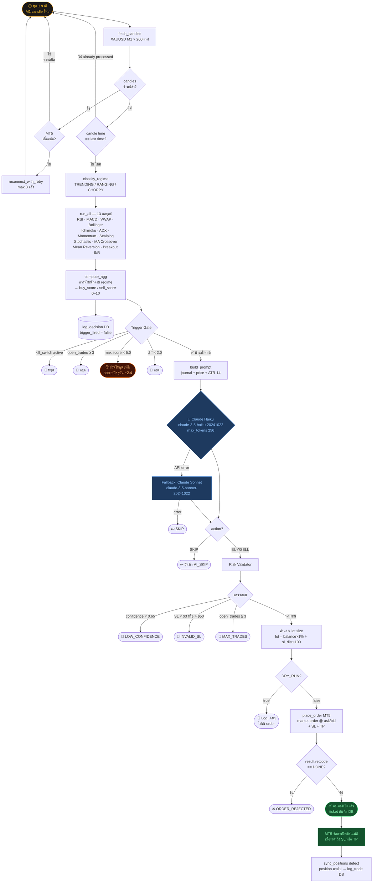

# OpenGold — Trading Flow

> อัปเดต: March 25, 2026 | Timeframe: M1 | Symbol: XAUUSD

---

## Diagram

---

## ขั้นตอนทีละ Step

| # | ขั้นตอน | ไฟล์ | รายละเอียด |
|---|---------|------|------------|
| 1 | **Fetch Candles** | `src/mt5_bridge/data.py` | ดึง M1 × 200 แท่ง จาก MT5 |
| 2 | **Regime Classifier** | `src/regime/classifier.py` | TRENDING / RANGING / CHOPPY |
| 3 | **13 Strategies** | `src/strategies/` | แต่ละตัวส่งกลับ `{ signal, confidence }` |
| 4 | **Aggregator** | `src/aggregator/scorer.py` | รวม + ถ่วงน้ำหนักตาม regime → `buy_score`, `sell_score` |
| 5 | **Trigger Gate** | `src/trigger/gate.py` | `max(buy,sell) ≥ 5.0` **และ** `\|buy−sell\| ≥ 2.0` |
| 6 | **Build Prompt** | `src/ai_layer/prompt.py` | รวม journal context + price + ATR(14) |
| 7 | **Claude Haiku** ← AI เริ่มทำงาน | `src/ai_layer/client.py` | Primary: `claude-3-5-haiku-20241022` → JSON: `{ action, confidence, sl, tp }` |
| 8 | **Fallback Sonnet** | `src/ai_layer/client.py` | fallback เมื่อ Haiku error → `claude-3-5-sonnet-20241022` |
| 9 | **Risk Validator** | `src/risk/engine.py` | confidence ≥ 0.65, SL $3–$50, lot = balance×1% ÷ sl_dist×100 |
| 10 | **Place Order** | `src/executor/orders.py` | market order ส่ง MT5 พร้อม SL + TP |
| 11 | **MT5 Auto-Close** | MT5 engine | MT5 ปิด position เองเมื่อถึง SL/TP |
| 12 | **Sync & Log** | `main.py` → `src/logger/writer.py` | `sync_positions()` detect ว่า position หายไป → `log_trade()` DB |

---

## Thresholds (config defaults)

| Parameter | ค่า |
|-----------|-----|
| `TRIGGER_MIN_SCORE` | **5.0** |
| `TRIGGER_MIN_SCORE_DIFF` | **2.0** |
| `MIN_AI_CONFIDENCE` | **0.65** (65%) |
| `MIN_SL_USD` | **$3.00** |
| `MAX_SL_USD` | **$50.00** |
| `RISK_PER_TRADE` | **1%** ของ balance |
| `MAX_CONCURRENT_TRADES` | **3** |
| `POLL_INTERVAL_SECONDS` | **5 วินาที** (loop check) |
| Claude Primary | `claude-3-5-haiku-20241022` |
| Claude Fallback | `claude-3-5-sonnet-20241022` |

---

## สถานะปัจจุบัน (March 25, 2026)

- Bot ทำงานอยู่ สแกนทุก 1 นาที
- `buy_score` สูงสุดที่พบ: **~2.4** (ต้องการ ≥ 5.0)
- Trigger Gate: **ยังไม่เคยผ่าน** → Claude Haiku ยังไม่เคยถูกเรียก
- จำนวน decisions ใน DB: **101 rows** (ทั้งหมด trigger_fired = false)
